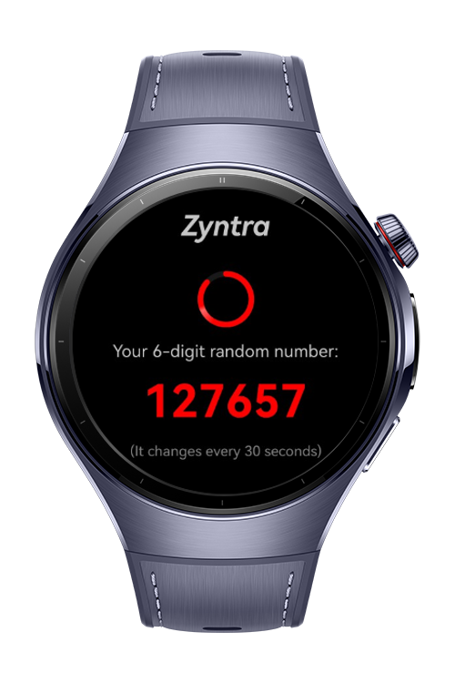

> **Note:** To access all shared projects, get information about environment setup, and view other guides, please visit [Explore-In-HMOS-Wearable Index](https://github.com/Explore-In-HMOS-Wearable/hmos-index).

# Password Authenticator

Password Authenticator is a demo app that generates time-based one-time passcodes (OTPs) for secure user authentication, refreshing every 30 seconds.

# Preview

<p align="left">
  
  
  
  
</p>

# Use Cases
Password Authenticator is generating password for different variety of apps.

# Tech Stack
Languages: ArkTS
Frameworks: HarmonyOS SDK 5.1.0(18)
Tools: DevEco Studio Vers 5.1.0.820
Libraries: @kit.ArkUI

# Directory Structure

   ```
   entry/src/main/ets/
   |---entryability
   |   |---EntryAbility.ets
   |---entrybackupability
   |   |---EntryBackupAbility.ets
   |---pages
   |   |---AddPasword.ets
   |   |---Index.ets                            
   |   |---Passwords.ets  
   |---view
   |   |---AddPasswordComponent.ets
   |   |---PasswordList.ets
   |   |---SecureRandomMock.ets    
   |---viewmodel   
   |   |---PasswordManager.ets
   |   |---PasswordModel.ets
   ```

# Constraints and Restrictions
## Supported Devices
Huawei Watch 5

# LICENSE

PasswordAuthenticator is distributed under the terms of the MIT License.
See the [LICENSE](/LICENSE) for more information.