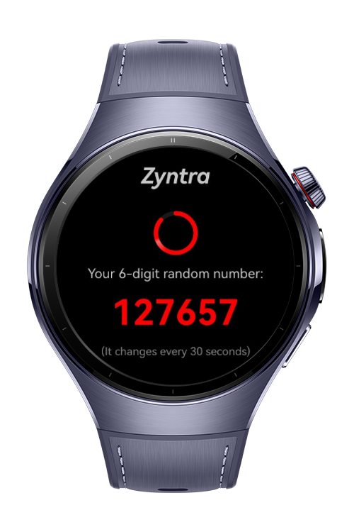

# Password Authenticator

Password Authenticator is a demo app that generates time-based one-time passcodes (OTPs) for secure user authentication,
refreshing every 30 seconds.

# Preview

<p align="left">
 
  
  
  
</p>

# Use Cases

Password Authenticator is generating password for different variety of apps.

# Technology

## Stack
- **Languages**: ArkTS, Typescript
- **Frameworks**: HarmonyOS SDK 5.0.2(14)
- **Tools**: DevEco Studio Vers 5.1.0.842
- **Libraries**:
    - @kit.ArkUI
    - @kit.SensorServiceKit'

## Required Permissions
- `ohos.permission.VIBRATE`

# Directory Structure

   ```
   entry/src/main/ets/
   |---entryability
   |   |---EntryAbility.ets
   |---entrybackupability
   |   |---EntryBackupAbility.ets
   |---pages
   |   |---AddPasword.ets
   |   |---Index.ets                            
   |   |---Passwords.ets  
   |---view
   |   |---AddPasswordComponent.ets
   |   |---PasswordList.ets
   |   |---SecureRandomMock.ets    
   |---viewmodel   
   |   |---PasswordManager.ets
   |   |---PasswordModel.ets
   ```

# Constraints and Restrictions

## Supported Devices

Huawei Watch 5

# LICENSE

PasswordAuthenticator is distributed under the terms of the MIT License.
See the [LICENSE](/LICENSE) for more information.